# PrismDB 🌈

**Transform Natural Language into Data Insights, Like Light into a Rainbow**

[](https://opensource.org/licenses/MIT)
[](https://www.python.org/)
[](https://github.com/nexiouscaliver/Prism-DB)

---

## **Why PrismDB?**  
Data analysts shouldn’t need to wrestle with query syntax or juggle multiple tools. **PrismDB** is a multi-agent framework that acts as a *contextual prism* for databases, transforming raw natural language queries into structured insights, visual reports, and actionable diagrams.  

Just as a prism splits light into vibrant colors, PrismDB:  
1. **Refracts** ambiguous user intents into precise queries.  
2. **Harmonizes** context from databases, schemas, and user history.  
3. **Synthesizes** outputs like charts, summaries, and dashboards.  

---

## **Features**  
✨ **Natural Language Interface** – “Show monthly sales trends for APAC region” instead of SQL.  
✨ **Multi-Model Database Support** – SQL, MongoDB, Cassandra, and more.  
✨ **Context-Aware Agents** – Understands schemas, user behavior, and domain semantics.  
✨ **Parallel Processing** – Agent swarms generate reports **5x faster** than manual workflows.  
✨ **Low-Code Integration** – REST API and Python SDK.  

---

## **How It Works**  

```mermaid
graph LR
  A[Natural Language Input] --> B(NLU Agent)
  B --> C{{PrismDB Framework}}
  C --> D[Schema Lens]
  C --> E[Query Forge]
  C --> F[Viz Engine]
  D --> G[(Database)]
  E --> G
  F --> H[Output Spectrum]
  G --> H
  H --> I[📈 Charts]
  H --> J[📊 Reports]
  H --> K[📂 Structured Data]
```


1. **Input**: Users describe tasks in plain language.  
2. **Prism Layers**:  
   - **NLU Agent**: Parses intent and entities.  
   - **Schema Lens**: Maps queries to database structures.  
   - **Query Forge**: Generates optimized SQL/NoSQL/Python.  
   - **Viz Engine**: Renders charts, graphs, or markdown reports.  
3. **Output**: Clean data, visualizations, or shareable documents.  

---

## **Getting Started**  

### Prerequisites  
- Docker and Docker Compose  
- Python 3.9+  

### Installation  
```bash
git clone https://github.com/your-org/prismdb  
cd prismdb  
docker-compose up -d  # Launches agents + demo database
```

### Basic Usage  
```python
from prismdb import PrismClient

client = PrismClient(api_key="your_key")
response = client.query(
    "Plot monthly sales trends for the APAC region in 2023",
    database_id="demo_sales"
)
response.visualize()  # Generates a Matplotlib/Plotly chart
```

---

## **Future Vision**  
- [ ] **Collaborative Filtering**: Agents debating conflicting query interpretations.  
- [ ] **AI-Powered Context**: Fine-tuned LLMs for industry-specific jargon.  
- [ ] **Data Storytelling**: Auto-generate narrative-driven analytics.  

---

## **Contributing**  
We welcome contributions! See [CONTRIBUTING.md](CONTRIBUTING.md) for guidelines.  

---

## **License**  
Distributed under the MIT License. See [LICENSE](LICENSE) for details.  

---

**PrismDB** isn’t just a tool—it’s a **new lens for data interaction**.  
Let’s make databases as intuitive as a conversation. ⚡️  

